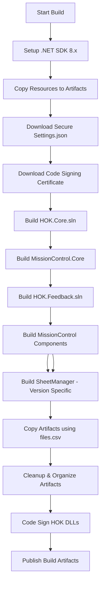

# GitHub Actions Migration Plan for HOK Revit Add-ins

Migration plan to convert the existing Azure Pipelines build configuration to GitHub Actions.

## Current Build System Analysis

The existing build system (configured for Azure DevOps) consists of:

### Build Configuration Files
- **[build.yml](file:///c:/Users/Mohsen.Assaqqaf/Documents/_ProgrammingProjects/_HOK_Projects/HOK-Revit-Addins-buildtest/_build/build.yml)** - Azure Pipelines YAML configuration (171 lines)
- **[local_build.ps1](file:///c:/Users/Mohsen.Assaqqaf/Documents/_ProgrammingProjects/_HOK_Projects/HOK-Revit-Addins-buildtest/_build/local_build.ps1)** - Local build script for testing
- **[files.csv](file:///c:/Users/Mohsen.Assaqqaf/Documents/_ProgrammingProjects/_HOK_Projects/HOK-Revit-Addins-buildtest/_build/files.csv)** - Artifact file mapping (57 entries)
- **[resources.csv](file:///c:/Users/Mohsen.Assaqqaf/Documents/_ProgrammingProjects/_HOK_Projects/HOK-Revit-Addins-buildtest/_build/resources.csv)** - Resource file mapping (4 entries)

### Helper Scripts
- **[copy_resources.ps1](file:///c:/Users/Mohsen.Assaqqaf/Documents/_ProgrammingProjects/_HOK_Projects/HOK-Revit-Addins-buildtest/_build/copy_resources.ps1)** - Copies resources to artifact folder structure
- **[copy_artifacts.ps1](file:///c:/Users/Mohsen.Assaqqaf/Documents/_ProgrammingProjects/_HOK_Projects/HOK-Revit-Addins-buildtest/_build/copy_artifacts.ps1)** - Copies build outputs based on files.csv
- **[cleanup_artifacts.ps1](file:///c:/Users/Mohsen.Assaqqaf/Documents/_ProgrammingProjects/_HOK_Projects/HOK-Revit-Addins-buildtest/_build/cleanup_artifacts.ps1)** - Organizes artifacts and triggers code signing
- **[codeSigning.ps1](file:///c:/Users/Mohsen.Assaqqaf/Documents/_ProgrammingProjects/_HOK_Projects/HOK-Revit-Addins-buildtest/_postBuild/codeSigning.ps1)** - Signs DLLs with certificate

### Build Process Flow



### Key Build Features

1. **Parameterized Builds**
   - `revitVersion` parameter (e.g., "2025")
   - `buildConfiguration` parameter (e.g., "Debug 25", "Release 25")

2. **Multiple Solution Builds** (in specific order)
   - HOK.Core.sln
   - HOK.MissionControl.Core.csproj
   - HOK.Feedback.sln
   - HOK.MissionControl.csproj
   - HOK.MissionControl.sln
   - All other HOK.*.sln files (excluding Core, MissionControl, Feedback, ParameterTools, FileOpeningMonitor, ModelReporting)
   - HOK.SheetManager.sln (version-specific: VSBuild for <2025, dotnet build for 2025+)

3. **Artifact Structure**
   ```
   _artifacts/
   └── {revitVersion}/
       ├── *.addin files (root)
       └── HOK-Addin.bundle/
           └── Contents/
               ├── *.dll files (37+ DLLs)
               └── Resources/
                   ├── HOK.Help.txt
                   ├── HOK.Installer.txt
                   ├── HOK.Tooltip.txt
                   └── HOK{revitVersion}Addins.csv
   ```

4. **Secret/Secure File Dependencies**
   - Settings.json (company-specific configuration)
   - CISign.pfx (code signing certificate)
   - CERT_SIGNING_PASS (certificate password)

5. **Code Signing**
   - All HOK.*.dll files are signed using SignTool
   - Uses timestamp server: http://timestamp.comodoca.com/authenticode

---

## Proposed GitHub Actions Workflow

The goal is to consolidate the build orchestration into a single `.github/workflows/hok-revit-addins-build.yml` file. While we will retain the helper scripts in `_build/` to support local developer builds (`local_build.ps1`), the GitHub Actions workflow will strictly control the CI/CD process.

### Workflow key features:
- **Single Source of Truth**: The `.yml` file defines the entire build pipeline.
- **Environment Compatibility**: Sets necessary environment variables (`BUILD_ENV`, `BUILD_CONFIGURATION`) so existing scripts run without modification where possible.
- **Secure Signing**: Directly handles certificate decoding and passes paths to the signing script.

### Workflow Structure

```yaml
name: HOK Revit Addins Build Workflow

on:
  push:
    branches: [ "main", "develop" ]
  pull_request:
    branches: [ "main", "develop" ]
  workflow_dispatch:
    inputs:
      revitVersion:
        description: 'Revit Version (e.g., 2025). Leave empty to run matrix build for all versions.'
        required: false
        default: ''
      buildConfiguration:
        description: 'Build Configuration prefix (e.g., Release). Scripts append the year (e.g. "Release 25").'
        required: true
        default: 'Release'

env:
  # Sets the environment flag so scripts know we are in CI
  BUILD_ENV: GitHubActions 
  SOURCE_DIR: ${{ github.workspace }}
  # Mapped to the input or default
  BUILD_CONFIGURATION: ${{ inputs.revitVersion || '2025' }}

jobs:
  build:
    name: Build for Revit ${{ inputs.revitVersion || '2025' }}
    runs-on: windows-latest
    
    steps:
      # ... (detailed steps below)
```


### Required GitHub Secrets

The following secrets must be configured in GitHub repository settings:

| Secret Name | Description | Azure DevOps Equivalent |
|-------------|-------------|------------------------|
| `SETTINGS_JSON` | Base64-encoded Settings.json file | Secure File: Settings.json |
| `CODE_SIGNING_CERT` | Base64-encoded PFX certificate | Secure File: CISign.pfx |
| `CERT_SIGNING_PASS` | Certificate password | Variable: CERT_SIGNING_PASS |

### Build Steps Mapping

| Azure Pipelines Step | GitHub Actions Equivalent |
|----------------------|---------------------------|
| `UseDotNet@2` | `actions/setup-dotnet@v4` (2025+ only) + `microsoft/setup-msbuild@v2` (2020-2024 only) |
| `PowerShell@2` (copy_resources) | `run:` PowerShell script |
| `DownloadSecureFile@1` | Decode from GitHub Secrets |
| `CopyFiles@2` | PowerShell `Copy-Item` |
| `DotNetCoreCLI@2` (nuget add source) | *(removed — all packages are on nuget.org)* |
| `DotNetCoreCLI@2` (build) | `run: dotnet build` |
| `VSBuild@1` (SheetManager) | `run: msbuild` or `dotnet build` |
| `PowerShell@2` (cleanup) | `run:` PowerShell script |
| `PublishBuildArtifacts@1` | `actions/upload-artifact@v4` |

### Detailed Implementation Steps

#### Step 1: Setup Environment
```yaml
- name: Checkout Code
  uses: actions/checkout@v4

# Revit 2025+ — targets net8.0-windows
- name: Setup .NET 8 SDK (Revit 2025+)
  if: matrix.revitVersion >= '2025'
  uses: actions/setup-dotnet@v4
  with:
    dotnet-version: 8.0.x

# Revit 2020-2024 — targets .NET Framework 4.7 (2020) or 4.8 (2021-2024)
- name: Setup MSBuild (Revit 2020-2024)
  if: matrix.revitVersion < '2025'
  uses: microsoft/setup-msbuild@v2
```

#### Step 2: Prepare Secure Files
```yaml
- name: Decode and Save Settings.json
  shell: pwsh
  run: |
    $settingsJson = [System.Convert]::FromBase64String("${{ secrets.SETTINGS_JSON }}")
    [System.IO.File]::WriteAllBytes("${{ github.workspace }}/HOK.Core/HOK.Core/Resources/Settings.json", $settingsJson)

- name: Decode and Save Code Signing Certificate
  shell: pwsh
  run: |
    New-Item -ItemType Directory -Path "${{ github.workspace }}/_cert" -Force
    $cert = [System.Convert]::FromBase64String("${{ secrets.CODE_SIGNING_CERT }}")
    [System.IO.File]::WriteAllBytes("${{ github.workspace }}/_cert/CISign.pfx", $cert)
```

#### Step 3: Copy Resources
```yaml
- name: Copy Resources to Artifacts
  shell: pwsh
  run: |
    $env:BUILD_CONFIGURATION = "${{ inputs.revitVersion || '2025' }}"
    & "${{ github.workspace }}/_build/copy_resources.ps1"
```

#### Step 4: Build Solutions (Sequential)
```yaml
- name: Build HOK.Core.sln
  shell: pwsh
  run: |
    dotnet build "HOK.Core\HOK.Core.sln" `
      -c "${{ inputs.buildConfiguration || 'Release 25' }}" `
      --artifacts-path "${{ github.workspace }}/_artifacts" `
      --property:OutputPath="${{ github.workspace }}/_artifacts/${{ inputs.revitVersion || '2025' }}"
  env:
    PFX_PASS: ${{ secrets.CERT_SIGNING_PASS }}
    PFX_PATH: ${{ github.workspace }}/_cert/CISign.pfx

- name: Build HOK.MissionControl.Core
  shell: pwsh
  run: |
    dotnet build "HOK.MissionControl\HOK.MissionControl.Core\HOK.MissionControl.Core.csproj" `
      -c "${{ inputs.buildConfiguration || 'Release 25' }}" `
      --artifacts-path "${{ github.workspace }}/_artifacts" `
      --property:OutputPath="${{ github.workspace }}/_artifacts/${{ inputs.revitVersion || '2025' }}"
  env:
    PFX_PASS: ${{ secrets.CERT_SIGNING_PASS }}
    PFX_PATH: ${{ github.workspace }}/_cert/CISign.pfx

# ... (repeat for other solutions)
```

#### Step 5: Build SheetManager (Version-Specific)
```yaml
- name: Build SheetManager (Pre-2025)
  if: ${{ inputs.revitVersion != '2025' }}
  shell: pwsh
  run: |
    msbuild "HOK.SheetManager\HOK.SheetManager.sln" `
      /t:Restore `
      /p:Configuration="${{ inputs.buildConfiguration || 'Release 25' }}" `
      /p:Platform="x64" `
      /p:OutputPath="${{ github.workspace }}/_artifacts/${{ inputs.revitVersion || '2025' }}"

- name: Build SheetManager (2025+)
  if: ${{ inputs.revitVersion == '2025' }}
  shell: pwsh
  run: |
    dotnet build "HOK.Utilities\HOK.ProjectSheetManager\HOK.ProjectSheetManager.csproj" `
      -c "${{ inputs.buildConfiguration || 'Release 25' }}" `
      --artifacts-path "${{ github.workspace }}/_artifacts" `
      --property:OutputPath="${{ github.workspace }}/_artifacts/${{ inputs.revitVersion || '2025' }}"
  env:
    PFX_PASS: ${{ secrets.CERT_SIGNING_PASS }}
    PFX_PATH: ${{ github.workspace }}/_cert/CISign.pfx
```

#### Step 6: Copy Artifacts
```yaml
- name: Copy Build Artifacts
  shell: pwsh
  run: |
    $env:BUILD_CONFIGURATION = "${{ inputs.revitVersion || '2025' }}"
    & "${{ github.workspace }}/_build/copy_artifacts.ps1"
```

#### Step 7: Cleanup and Code Sign
```yaml
- name: Cleanup and Code Sign Artifacts
  shell: pwsh
  run: |
    $env:BUILD_CONFIGURATION = "${{ inputs.revitVersion || '2025' }}"
    $env:PFX_PASS = "${{ secrets.CERT_SIGNING_PASS }}"
    $env:PFX_PATH = "${{ github.workspace }}/_cert/CISign.pfx"
    & "${{ github.workspace }}/_build/cleanup_artifacts.ps1"
```

#### Step 8: List Files (Debug)
```yaml
- name: List Artifact Files
  shell: pwsh
  run: |
    Get-ChildItem -Path "${{ github.workspace }}/_artifacts" -Recurse
```

#### Step 9: Create Release Artifact
```yaml
- name: Zip Build Artifacts
  shell: pwsh
  run: |
    $revitVer = "${{ inputs.revitVersion || '2025' }}"
    Compress-Archive `
      -Path "${{ github.workspace }}/_artifacts/$revitVer/*" `
      -DestinationPath "${{ github.workspace }}/HOK-Revit-Addins-$revitVer.zip"

- name: Upload Build Artifacts
  uses: actions/upload-artifact@v4
  with:
    name: HOK-Revit-Addins-${{ inputs.revitVersion || '2025' }}
    path: ${{ github.workspace }}/HOK-Revit-Addins-${{ inputs.revitVersion || '2025' }}.zip
    retention-days: 90
```

#### Step 10: Create GitHub Release (Optional)
```yaml
- name: Create GitHub Release
  if: github.event_name == 'push' && github.ref == 'refs/heads/main'
  uses: softprops/action-gh-release@v2
  with:
    name: HOK Revit Addins - Revit ${{ inputs.revitVersion || '2025' }}
    tag_name: v${{ github.run_number }}-revit-${{ inputs.revitVersion || '2025' }}
    body: |
      Automated build for Revit ${{ inputs.revitVersion || '2025' }}
      
      **Build Configuration:** ${{ inputs.buildConfiguration || 'Release 25' }}
      **Commit:** ${{ github.sha }}
      **Branch:** ${{ github.ref_name }}
    files: HOK-Revit-Addins-${{ inputs.revitVersion || '2025' }}.zip
    make_latest: true
    token: ${{ secrets.GITHUB_TOKEN }}
    token: ${{ secrets.GITHUB_TOKEN }}
```

#### Step 11: Create Release Job
```yaml
- name: Create Release
  if: github.event_name == 'push' && (github.ref == 'refs/heads/main' || github.ref == 'refs/heads/master')
  needs: build
  runs-on: windows-latest
  steps:
    - name: Download All Artifacts
      uses: actions/download-artifact@v4
      with:
        path: artifacts

    - name: Create Release
      uses: softprops/action-gh-release@v2
      with:
        files: artifacts/**/*.zip
        make_latest: true
        token: ${{ secrets.GITHUB_TOKEN }}
        # ... (Name, tag, body configuration)
```


---

## Key Differences: Azure Pipelines vs GitHub Actions

| Feature | Azure Pipelines | GitHub Actions |
|---------|----------------|----------------|
| **Secure Files** | `DownloadSecureFile@1` task | Base64-encoded secrets + decode |
| **Variable Groups** | `- group: code-signing` | Repository secrets |
| `NuGet Auth` | Azure Artifacts integration | Not required — all packages from nuget.org |
| **Artifact Publishing** | `PublishBuildArtifacts@1` | `actions/upload-artifact@v4` |
| **MSBuild** | `VSBuild@1` task | Direct `msbuild` command |
| **Environment Variables** | Task-level `env:` | Step-level `env:` |
| **Build Agent** | `vmImage: windows-latest` | `runs-on: windows-latest` |

---

## Code Signing Considerations

### Current Implementation
The `codeSigning.ps1` script detects the build environment:
- **Azure DevOps**: Uses SignTool from `C:\Program Files (x86)\Microsoft SDKs\ClickOnce\SignTool\signtool.exe`
- **Local**: Uses SignTool from Windows SDK

### GitHub Actions Adaptation
The `codeSigning.ps1` script currently checks for `AzureDevOps`. We need to update it to support `GitHubActions` or use a generic flag.

**Plan**: Update `_postBuild/codeSigning.ps1` to check for specific environment variables or simply allow the caller to specify the signing tool path if needed. The simplest change is to treat `GitHubActions` same as `AzureDevOps` regarding the use of the `PFX_PASS` and `PFX_PATH` environment variables, but we must ensure `signtool.exe` is found.

GitHub Actions Windows runners typically have `signtool.exe` in the path or available via `setup-dotnet` / Visual Studio installation. We might need to add a step to locate or setup `signtool`.

```powershell
# _postBuild/codeSigning.ps1 update
If ($Env:BUILD_ENV -eq 'AzureDevOps' -or $Env:BUILD_ENV -eq 'GitHubActions') {
    $p = $Env:PFX_PASS
    # Note: Path to signtool might vary on GitHub Actions runners. 
    # It is safer to use a "runt-time" path or rely on PATH if configured.
    # For now, we will try the standard path or use a 'setup-msbuild' action which often helps.
    &"C:\Program Files (x86)\Windows Kits\10\bin\10.0.17763.0\x86\signtool.exe" sign /f $Env:PFX_PATH /p $p /t http://timestamp.comodoca.com/authenticode $DLL_PATH
} Else {
    # Local build
    &"C:\Program Files (x86)\Windows Kits\10\bin\10.0.18362.0\x86\signtool.exe" sign /c 'Code Signing - DTM HOK-CA' /t http://timestamp.comodoca.com/authenticode $DLL_PATH
}
```

> [!WARNING]
> Verify that SignTool is available on GitHub-hosted Windows runners. If not, you may need to install Windows SDK or use a different signing approach.

---

## Matrix Build Strategy (Implemented)

The workflow uses a matrix strategy to build all supported Revit versions in parallel on every run. This is the primary (and only) build strategy — there is no single-version mode at the runner level.

```yaml
strategy:
  fail-fast: false
  matrix:
    revitVersion: ['2020', '2021', '2022', '2023', '2024', '2025', '2026']
```

When a manual `workflow_dispatch` trigger specifies a single `revitVersion`, a **Check Matrix Filter** step at the top of each job skips jobs that don't match the requested version — effectively running only one version without changing the matrix definition.

---

## Testing Strategy

1. **Local Testing**
   - Use `local_build.ps1` to verify build process before GitHub Actions migration
   - Test with different Revit versions and configurations

2. **GitHub Actions Testing**
   - Start with `workflow_dispatch` (manual trigger) for initial testing
   - Test with a single Revit version first
   - Gradually enable automatic triggers (push/PR)

3. **Validation Checklist**
   - [ ] All 37+ DLLs are built successfully
   - [ ] Artifact structure matches expected layout
   - [ ] All .addin files are in correct locations
   - [ ] Resource files are copied correctly
   - [ ] HOK DLLs are code-signed
   - [ ] Zip artifact contains all necessary files
   - [ ] Build works for multiple Revit versions

---

## Migration Checklist

### Prerequisites
- [ ] Create GitHub repository secrets (SETTINGS_JSON, CODE_SIGNING_CERT, CERT_SIGNING_PASS)
- [ ] Encode Settings.json and CISign.pfx to Base64
- [ ] Verify SignTool availability on GitHub runners

### Implementation
- [ ] Create new workflow file: `.github/workflows/hok-revit-addins-build-copy.yml`
- [ ] Update `codeSigning.ps1` to support GitHub Actions environment
- [ ] Test workflow with manual trigger (`workflow_dispatch`)
- [ ] Validate artifact output structure
- [ ] Test code signing functionality
- [ ] Configure automatic triggers (push/PR)

### Optional Enhancements
- [ ] Implement matrix build for multiple Revit versions
- [ ] Add build status badges to README
- [ ] Configure branch protection rules
- [ ] Set up automated release creation
- [ ] Add build notifications (Slack, email, etc.)

---

## Estimated Effort

| Task | Estimated Time |
|------|----------------|
| Secret configuration | 30 minutes |
| Workflow file creation | 2-3 hours |
| Testing and debugging | 2-4 hours |
| Documentation updates | 1 hour |
| **Total** | **5-8 hours** |

---

## Next Steps

1. Review this implementation plan
2. Confirm secret availability (Settings.json, certificates, tokens)
3. Decide on workflow triggers (manual, push, PR, or all)
4. Determine if matrix builds are needed
5. Proceed with workflow file creation and testing
